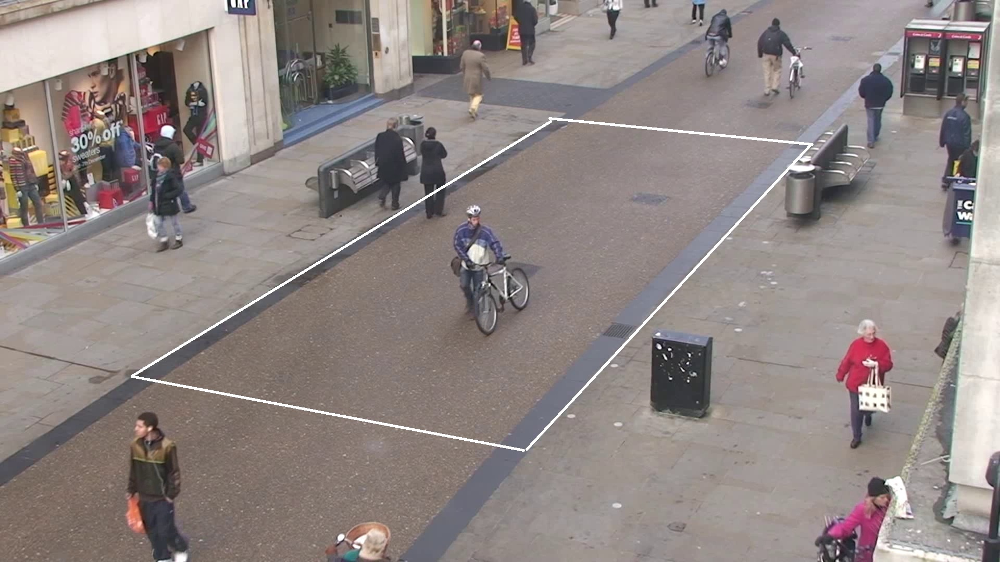

# Bird-Eye-proyect
Proyecto del cambio de perspectiva y deteccion de personas en peligro

Para este proyecto se hizo una transformacion en perspectiva, la perspectiva utlizada fue un cuadrilatero armado con las 2 rectas de la pista, de forma que, al hacer la transformacion, estas se vean rectas. El cuadrilatero se puede ver en la siguiente imagen.

Sin embargo, al hacer la transformacion, se mapea la perspectiva desde el punto (0,0). Para evitar perder informacion se agrega a la matriz de transformacion otra matriz de traslacion, con el fin de mover la imagen hasta que se pueda ver la mayor parte de informacion. La cantidad para trasladar se calcula mapeando los bordes de la imagen original despues de aplicar la transformacion en perspectiva. Con esto, se traslada la imagen hasta que se pueda ver la mayor parte de la imagen.

Finalmente, para determinar si una persona esta o no en peligro, se calcula la distancia haciendo la conversion de la pista a pixeles. En la imagen transformada cada metro equivale a 160 pixeles. En este caso se determino 2 metros como una distancia segura, si los puntos estan mas cerca que esa distancia se colocaran en rojo

Tambien se agregaron algunas estadisticas que se pueden cargar del archivo estadistics.csv. Este csv se puede cargar directamente en el notebook para realizar ciertas graficas o se puede correr el codigo para que este mismo lo procese.
